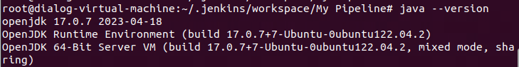
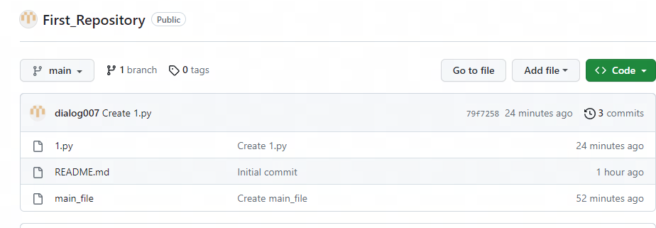
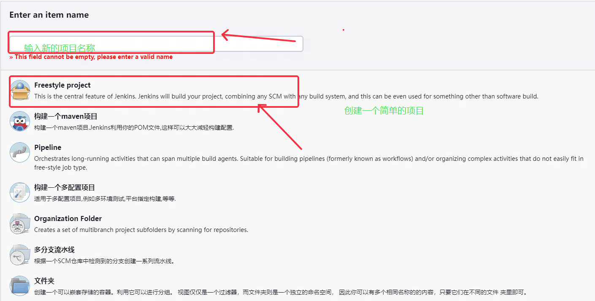
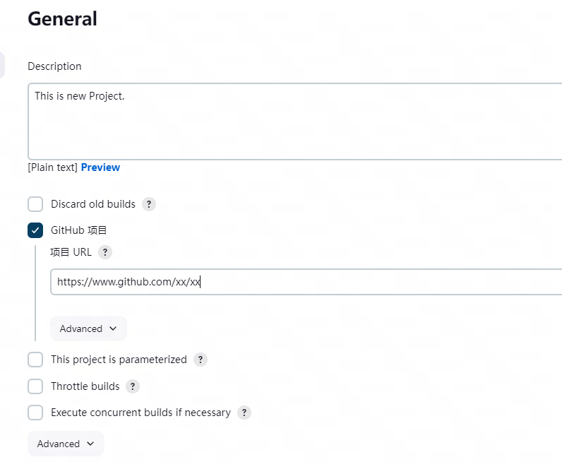
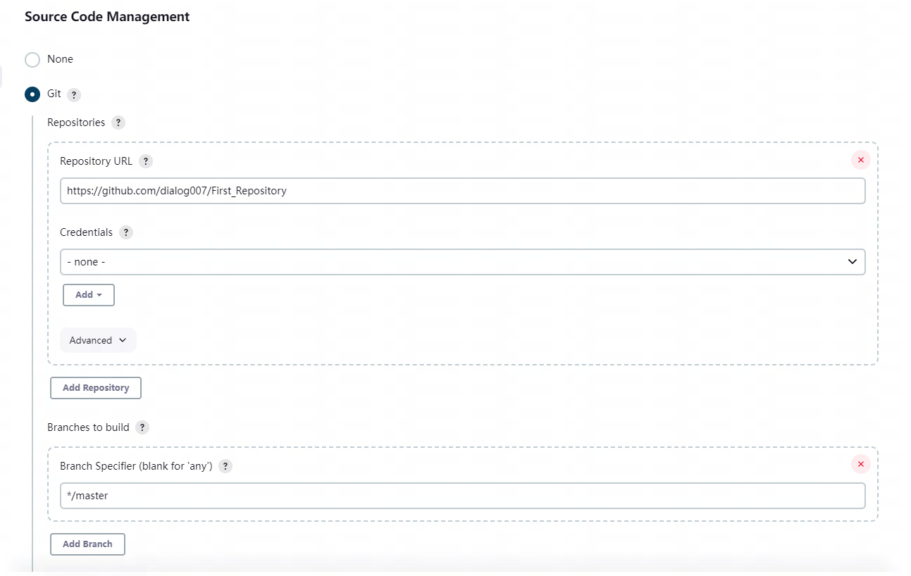
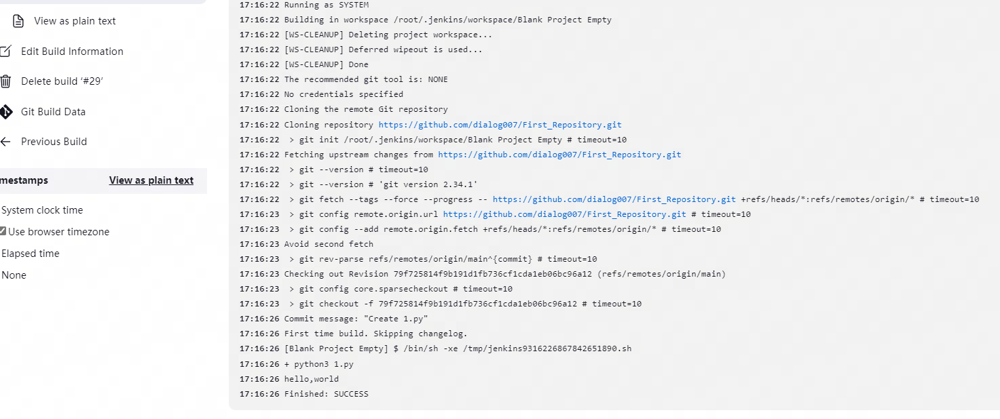

# 通过 Jenkins 构建一个简单的空项目
## 1.安装Jenkins
#### 1.1 Jenkins的作用
Jenkins 是一个集成了ci/cd的项目管理工具，可以用于源代码管理和流水线管理，并提供了较好的可视化界面。

#### 1.2 在ubuntu中安装依赖环境
  一、安装java环境

```
  #查看系统支持的java版本
  java --version
  #选择合适的java版本，并使用apt进行安装
  apt-get install java
```


此处安装的java版本为openjdk-17

 二、安装wget用于下载jenkins的war包
```
  apt-get install wget
```
三、通过wget下载官方war包
```
http://mirrors.jenkins.io/war-stable/latest/jenkins.war
```
四、通过java运行下载的war包，并指定端口
```
java -jar jenkins.war --httpPort=8080
```
五、根据系统提示，通过浏览器访问http://localhost:8080,输入密码，进入jenkins系统，并完成系统的基本设置。
```
  #初始密码查看
  cat /root/.jenkins/secrets/initialAdminPassword
  #并在浏览器输入这一密码进入系统
```

## 2.进入系统创建一个新的项目
#### 2.1 前往github创建一个空的仓库
此处，我设置的仓库为https://github.com/dialog007/First_Repository，是一个public仓库，无需进行账号密码校验。



#### 2.2 在jenkins中创建一个新的items



创建一个自由格式的软件，并输入您的项目名称来进入下一步操作。

#### 2.3 填写项目的基本信息、



#### 2.4 编辑Source code management实现源代码管理



这里，我直接填写了我的github项目地址，填写该栏目后，能够直接和github仓库中的数据进行同步。
此外，在Branches to build栏目中，通过填写Branch Specifier栏目信息，可以指定数据更新来源于哪一个分支，多分支的协同开发能够提高效率。

#### 2.5 常见问题
一、找不到分支，填写信息不一致
```
17:14:52 ERROR: Couldn't find any revision to build. Verify the repository and branch configuration for this job.
```
在出现这一报错时，需要注意，github的主分支名称为main，但是在Jenkins中，我们的主分支默认为master。通过修改source code management中的Branches to build中的栏目和github仓库的分支名称一致来避免这一问题的出现。

二、git源不正确
```
16:18:03 ERROR: Error cloning remote repo 'origin'
```
出现这一问题可能是安装Jenkins的服务器中，没有安装git命令。通过
```
apt-get install git
```
安装git后，刷新页面，重新填写source code management中的git地址，即可解决该问题。


## 3.构建后操作
#### 3.1 Build Steps设置
在构建成功后，可以通过Build Steps中的Execute shell来执行特定的代码，从而在构建后进行执行。
需要注意，我的仓库中编写了一个1.py的文件，实现了输出helloworld的功能，但是执行需要在安装了Jenkins的服务器中拥有python3的环境，否则将无法执行。

在构建成功后，系统将会自动执行Execute Shell中的命令。

